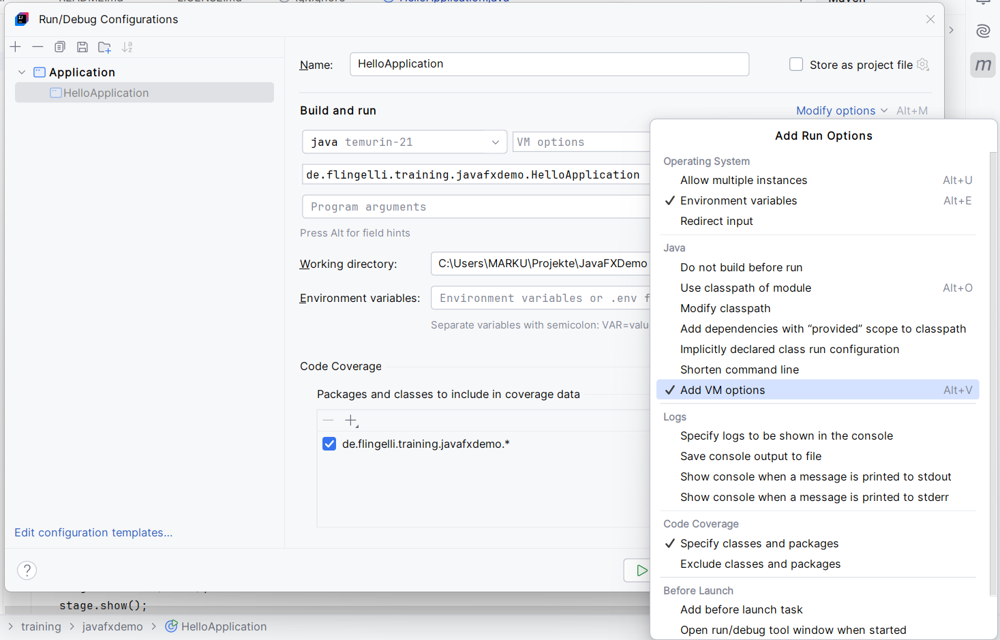
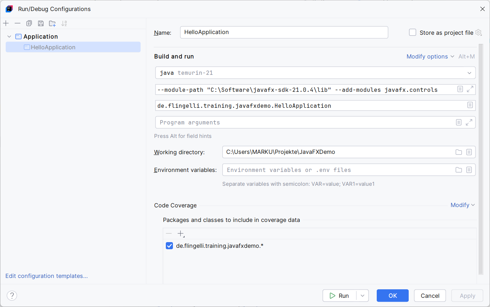

# JavaFX Demo


Damit diese Anwendung ausgeführt werden kann, muss die OpenJX-Bibliothek zur Verfügung stehen.
Diese kann auf folgender Webseite heruntergeladen werden: [https://gluonhq.com/products/javafx/](https://gluonhq.com/products/javafx/)

## IntelliJ

Die Integration von JavaFX und IntelliJ ist hier zu finden: [https://openjfx.io/openjfx-docs/](https://openjfx.io/openjfx-docs/)

Der Pfad zur OpenFX-Installation mus in den Run/Debug-Konfigurationen unter den VM-Optionen angegeben werden:

Unter **Modify Options** muss der Eintrag **Add VM options** ausgewählt werden:





Die vollständige Angabe lautet beispielsweise:

```
--module-path "C:\Software\javafx-sdk-21.0.4\lib" --add-modules javafx.controls
```

Die OpenFX-Installation befindet sich im Ordner ```C:\Software\javafx-sdk-21.0.4\lib```. Da
auch das Modul ```javafx.controls``` verwendet werden soll, ist dieses anzugeben.

## JavaFX controls

Das GitHub-Projekt controlsfx stellt zusätzliche UI-Elemente zur Verfügung.
Mehr Informationen dazu können auf deren Webseite abgerufen werden:

* Homepage: [https://controlsfx.github.io/](https://controlsfx.github.io/)
* GitHub: [https://github.com/controlsfx/controlsfx](https://github.com/controlsfx/controlsfx)